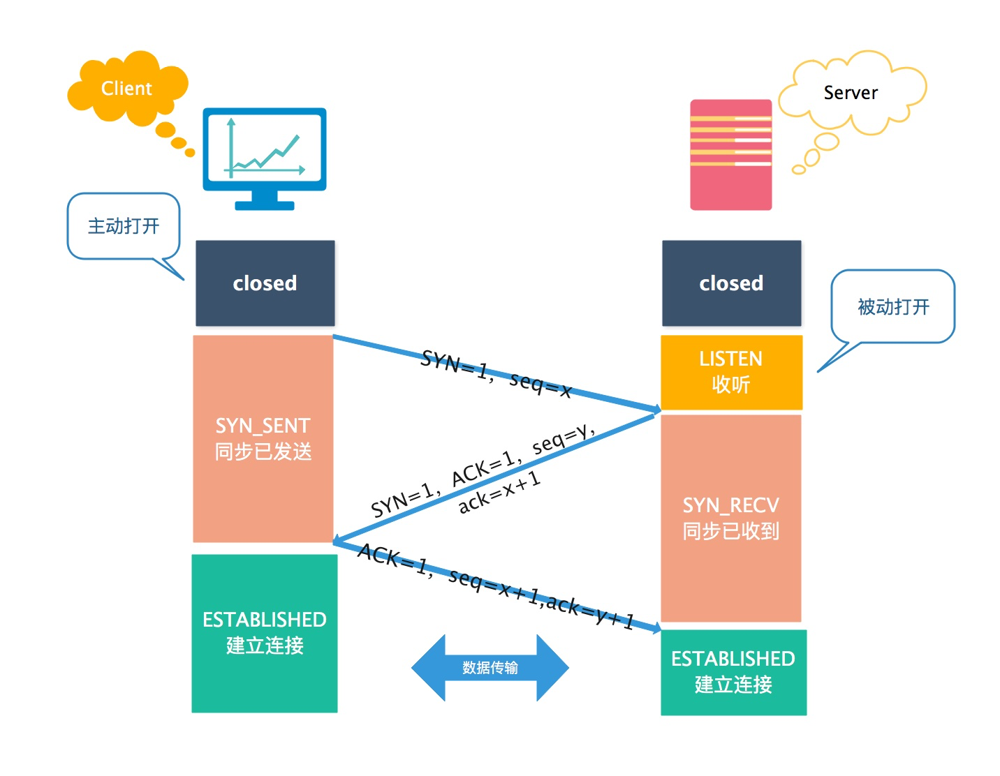
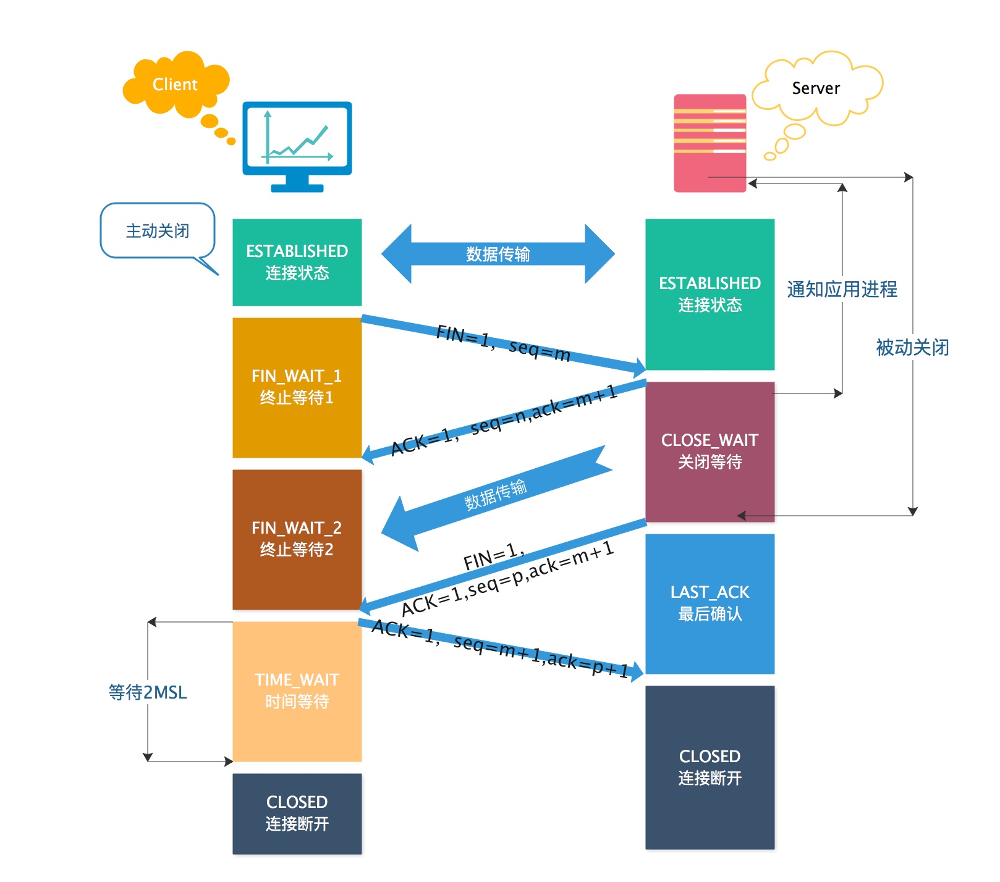

# 三次握手和四次挥手的详细介绍

三次握手和四次挥手是一个经典的面试题，于是乎我特地整理了一番，如果能够帮到你的话那自然是很好的事情了。

## 一、tcp标志位都是什么？
> 有6种标示：
> 1. SYN(synchronous建立联机) 
> 2. ACK(acknowledgement 确认) 
> 3. PSH(push传送) 
> 4. FIN(finish结束) 
> 5. RST(reset重置)
> 6. URG(urgent紧急)

> 2种序列号码
> 1. Sequence number(顺序号码) 
> 2. Acknowledge number(确认号码)

`备注：ACK、SYN和FIN这些大写的单词表示标志位，其值为0或1；ack(ack number)、seq(seq number)小写的单词表示序号。`

## 二、TCP三次握手
### 1.TCP三次握手概述
所谓三次握手(Three-way Handshake)，是指建立一个TCP连接时，需要客户端和服务器总共发送3个包。
三次握手的目的是连接服务器指定端口，建立TCP连接,并同步连接双方的序列号和确认号并交换 TCP 窗口大小信息.在socket编程中，客户端执行connect()时，将触发三次握手。

### 2.tcp三次握手的顺序
 

第一次握手：客户端Client发送位码为SYN＝1，随机产生seq number=x的数据包到服务器，服务器Server由SYN=1知道，客户端Client要求建立联机；
第二次握手：服务器Server收到请求后要确认联机信息，向客户端Client发送ack number=(客户端Client的seq+1)，SYN=1，ACK=1，随机产生seq number=y的包；
第三次握手：客户端Client收到后检查ack number是否正确，即第一次发送的seq number+1，以及位码ACK是否为1，若正确，客户端Client会再发送ack number=(服务器Server的seq number+1)，ACK=1，服务器Server收到后确认ack  number值与ACK=1则连接建立成功。

### 3.SYN攻击
+ `危害：`SYN攻击属于DOS攻击的一种，它利用TCP协议缺陷，通过发送大量的半连接请求，耗费CPU和内存资源。SYN攻击除了能影响主机外，还可以危害路由器、防火墙等网络系统，事实上SYN攻击并不管目标是什么系统，只要这些系统打开TCP服务就可以实施。
+ `原理：`在三次握手过程中，服务器发送SYN-ACK之后，收到客户端的ACK之前的TCP连接称为半连接(half-open connect).此时服务器处于SYN_RECV状态.当收到ACK后，服务器转入ESTABLISHED状态.SYN攻击就是 攻击客户端 在短时间内伪造大量不存在的IP地址，向服务器不断地发送SYN包，服务器回复确认包，并等待客户的确认，由于源地址是不存在的，服务器需要不断的重发直 至超时，这些伪造的SYN包将长时间占用未连接队列，正常的SYN请求被丢弃，目标系统运行缓慢，严重者引起网络堵塞甚至系统瘫痪。
+ `检测：`检测SYN攻击非常的方便，当你在服务器上看到大量的半连接状态时，特别是源IP地址是随机的，基本上可以断定这是一次SYN攻击。
+ `防范：`主要有两大类，一类是通过防火墙、路由器等过滤网关防护，另一类是通过加固TCP/IP协议栈防范.但必须清楚的是，SYN攻击不能完全被阻止，我们所做的是尽可能的减轻SYN攻击的危害，除非将TCP协议重新设计。
> 1. 过滤网关防护
>> * 网关超时设置
>> * SYN网关
>> * SYN代理
> 2. 加固tcp/ip协议栈
>> * SynAttackProtect机制
>> * SYN cookies技术
>> * 增加最大半连接数
>> * 缩短超时时间

## 三、四次挥手过程理解 

1. 客户端Client进程发出连接释放报文，并且停止发送数据。释放数据报文首部，FIN=1，其序列号为seq=m（等于前面已经传送过来的数据的最后一个字节的序号加1），此时，客户端Client进入FIN-WAIT-1（终止等待1）状态。 TCP规定，FIN报文段即使不携带数据，也要消耗一个序号。
2. 服务器Server收到连接释放报文，发出确认报文，ACK=1，ack=m+1，并且带上自己的序列号seq=n，此时，服务器Server就进入了CLOSE-WAIT（关闭等待）状态。TCP服务器通知高层的应用进程，客户端Client向服务器的方向就释放了，这时候处于半关闭状态，即客户端Client已经没有数据要发送了，但是服务器Server若发送数据，客户端Client依然要接受。这个状态还要持续一段时间，也就是整个CLOSE-WAIT状态持续的时间。
3. 客户端Client收到服务器Server的确认请求后，此时，客户端Client就进入FIN-WAIT-2（终止等待2）状态，等待服务器Server发送连接释放报文（在这之前还需要接受服务器Server发送的最后的数据）。
4. 服务器Server将最后的数据发送完毕后，就向客户端发送连接释放报文，FIN=1，ack=m+1，由于在半关闭状态，服务器Server很可能又发送了一些数据，假定此时的序列号为seq=p，此时，服务器Server就进入了LAST-ACK（最后确认）状态，等待客户端Client的确认。
5. 客户端Client收到服务器Server的连接释放报文后，必须发出确认，ACK=1，ack=p+1，而自己的序列号是seq=m+1，此时，客户端Client就进入了TIME-WAIT（时间等待）状态。注意此时TCP连接还没有释放，必须经过2*MSL（最长报文段寿命）的时间后，当客户端Client撤销相应的TCB后，才进入CLOSED状态。
6. 服务器Server只要收到了客户端Client发出的确认，立即进入CLOSED状态。同样，撤销TCB后，就结束了这次的TCP连接。可以看到，服务器Server结束TCP连接的时间要比客户端Client早一些。

## 四、常见面试题
### 1.为什么连接的时候是三次握手，关闭的时候却是四次握手？
答：这是因为服务端的LISTEN状态下的SOCKET当收到SYN报文的建连请求后，它可以把ACK和SYN（ACK起应答作用，而SYN起同步作用）放在一个报文里来发送。但关闭连接时，当收到对方的FIN报文通知时，它仅仅表示对方没有数据发送给你了；但未必你所有的数据都全部发送给对方了，所以你可以未必会马上会关闭SOCKET,也即你可能还需要发送一些数据给对方之后，再发送FIN报文给对方来表示你同意现在可以关闭连接了，所以它这里的ACK报文和FIN报文多数情况下都是分开发送的

### 2.为什么TIME_WAIT状态需要经过2MSL(最大报文段生存时间)才能返回到CLOSE状态？
答：虽然按道理，四个报文都发送完毕，我们可以直接进入CLOSE状态了，但是我们必须假象网络是不可靠的，有可以最后一个ACK丢失。所以TIME_WAIT状态就是用来重发可能丢失的ACK报文。在Client发送出最后的ACK回复，但该ACK可能丢失。Server如果没有收到ACK，将不断重复发送FIN片段。所以Client不能立即关闭，它必须确认Server接收到了该ACK。Client会在发送出ACK之后进入到TIME_WAIT状态。Client会设置一个计时器，等待2MSL的时间。如果在该时间内再次收到FIN，那么Client会重发ACK并再次等待2MSL。所谓的2MSL是两倍的MSL(Maximum Segment Lifetime)。MSL指一个片段在网络中最大的存活时间，2MSL就是一个发送和一个回复所需的最大时间。如果直到2MSL，Client都没有再次收到FIN，那么Client推断ACK已经被成功接收，则结束TCP连接。

### 3.为什么不能用两次握手进行连接？
答：3次握手完成两个重要的功能，既要双方做好发送数据的准备工作(双方都知道彼此已准备好)，也要允许双方就初始序列号进行协商，这个序列号在握手过程中被发送和确认。现在把三次握手改成仅需要两次握手，死锁是可能发生的。作为例子，考虑服务器Server和客户端Client之间的通信，假定客户端Client给服务器Server发送一个连接请求分组，服务器Server收到了这个分组，并发 送了确认应答分组。按照两次握手的协定，服务器Server认为连接已经成功地建立了，可以开始发送数据分组。可是，客户端Client在服务器Server的应答分组在传输中被丢失的情况下，将不知道服务器Server是否已准备好，不知道服务器Server建立什么样的序列号，客户端Client甚至怀疑服务器Server是否收到自己的连接请求分组。在这种情况下，客户端Client认为连接还未建立成功，将忽略服务器Server发来的任何数据分 组，只等待连接确认应答分组。而服务器Server在发出的分组超时后，重复发送同样的分组。这样就形成了死锁。

### 4.如果已经建立了连接，但是客户端突然出现故障了怎么办？
TCP还设有一个保活计时器，显然，客户端如果出现故障，服务器不能一直等下去，白白浪费资源。服务器每收到一次客户端的请求后都会重新复位这个计时器，时间通常是设置为2小时，若两小时还没有收到客户端的任何数据，服务器就会发送一个探测报文段，以后每隔75秒钟发送一次。若一连发送10个探测报文仍然没反应，服务器就认为客户端出了故障，接着就关闭连接。
