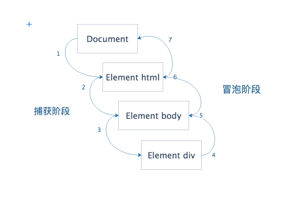

# js学习笔记[抄书之路] — event
## 1.事件流
浏览器发展到第四代时（IE4及 Netscape Communicator 4），浏览器开发团队遇到一个问题：页面的哪个部分会拥有某个特定的事件？可以想象在一张纸上的一组同心圆，如果把手指放在圆心上，那么你的手指指向的不是一个圆，而是纸上的所有圆。即在点击一个按钮时，不仅点击了按钮，也点击了整个页面。

事件流描述的是从页面中接收事件的顺序。不过IE 和 Netscape 开发团队提出的想法差不多完全相反。

IE的事件流是事件冒泡流，而  Netscape Communicator 的事件流是事件捕获流。

### 1.1 事件冒泡
IE的事件流叫做事件冒泡（event bubbling），即事件开始时是由最具体的元素接收，然后逐级向上传播到较为不具体的节点。

`备注：所有现代的浏览器都支持事件冒泡，但是在具体实现上还有一些差别。IE5.5 以及更早的版本中的事件冒泡会跳过 html 元素，即从body直接到 document。而IE9、Firefox、Chrome和Safari则将事件一直冒泡到window对象。`

### 1.2 事件捕获
Netscape Communicator 团队提出的另一种事件流叫做事件捕获。思想是不太具体的节点应该更早的接收到事件，而最具体的节点应该最后接收到事件。

事件捕获的用意在于事件到达预定目标之前捕获它。

虽然 事件捕获 是Netscape Communicator 唯一支持的事件流模型，但是IE9、Firefox、Opera、Chrome和Safari目前也都支持这种事件流模型。

尽管“DOM2级事件”规范要求事件应该从document对象开始传播，但是这些浏览器都是从window对象开始捕获事件的。

由于老版本的浏览器不支持，因此很少有人使用事件捕获。

### 1.3 DOM 事件流
“DOM2级事件”规定的事件流包括三个阶段：事件捕获阶段、处于目标阶段和事件冒泡阶段。首先发生的是事件捕获，这为截获事件提供了机会。然后是实际的目标接收到事件。最后一个阶段是冒泡阶段，可以在这个阶段对事件作出响应。



## 2. 事件处理程序
### 2.1 HTML 事件处理程序
如下：
```
<input type="button" value="click" onclick="alert('hello')" />
```

### 2.2 DOM0级事件处理程序
通过JavaScript指定事件处理程序的传统方式，就是将一个函数赋值给一个事件处理程序属性。这种为事件处理程序赋值的方法是在第四代Web浏览器中出现的，而且至今仍然为所有现代浏览器支持。一是简单，二是具有跨浏览器优势。

每个元素都有自己的事件处理程序属性，这些属性通常全部小写，例如：onclick。将这种属性的值设置为一个函数，就可以制定事件处理程序。

如下例：
```
var btn = document.getElementById("myBtn");
btn.onclick = function(){
    alert(this.id); // "myBtn"
}
btn.onclick = null; // 删除事件处理程序
```
以这种方式添加的事件处理程序会在事件流的冒泡阶段被处理。

### 2.3 DOM2级事件处理程序
“DOM2级事件”定义了两个方法，用于处理指定和删除事件处理程序的操作：addEventListener()和removeEventListener()。都接受三个参数：要处理的事件名、作为事件处理程序的函数和一个布尔值。最后这个布尔值参数如果是true，表示在捕获阶段调用事件处理程序；如果是false，表示在冒泡阶段调用事件处理程序。默认是 false。

使用DOM2级方法添加事件处理程序的主要好处是可以添加多个事件处理程序。
```
var btn = document.getElementById("myBtn");
btn.addEventListener("click",function(){alert(this.id)}) // this 指的是元素本身
btn.addEventListener("click",function(){alert("hello word!"))})
```
通过 addEventListener 添加的事件，只能通过 removeEventListener 移除掉，移除时的参数需要和传入的参数相同。这也意味着传入的匿名参数无法移除。因此尽量避免使用匿名函数。

大多数情况下，都是把事件处理程序添加到事件流的冒泡阶段，这样可以最大限度的兼容各种浏览器。万不得已的时候，再添加到捕获阶段。

### 2.4 IE事件处理程序
IE实现了与DOM中类似的两个方法，attachEvent() 和 detachEvent()。这两个方法接收两个参数，因为只支持冒泡。
与addEventListener 和 removeEventListener 不同的是，接受的第一个参数，必须带on。如单击事件，为"onclick"；还有添加多个事件的时候，此方法按照添加的顺序反向执行。

此方法与DOM0级方法的主要区别是在于事件处理程序的作用域。此方法的事件处理程序会在全局作用域中运行，其中的this为window

### 2.5  跨浏览器的事件处理程序
因为不同浏览器对于事件的处理不一样，所以可以手写一些事件兼容方法。如下:
```
var EventUtil = {
    // 添加事件处理程序
    addHandler: function(element, type, handler) {
        if (element.addEventListener) { // DOM2级 事件处理程序，this 指向元素本身。按照添加的顺序正向执行
            element.addEventListener(type, handler, false);
        } else if (element.attachEvent) { // IE 事件处理程序，this 指向 window。按照添加的顺序反向执行
            element.attachEvent("on" + type, handler);
        } else { // DOM0级 事件处理程序。只能绑定一个事件处理程序
            element["on" + type] = handler;
        }
    },
    // 移除事件处理程序
    removeHandler: function(element, type, handler) {
        if (element.removeEventListener) {
            element.removeEventListener(type, handler, false);
        } else if (element.detachEvent) {
            element.detachEvent("on" + type, handler);
        } else {
            element["on" + type] = null;
        }
    },
    // 获取 event 对象。window.event 为 IE 浏览器的获取方式
    getEvent: function(event) {
        return event ? event : window.event;
    },
    // 获取event的target。 event.srcElement 只对老版本的 IE 浏览器有效
    getTarget: function(event) {
        return event.target || event.srcElement;
    },
    // 取消事件的默认行为
    preventDefault: function(event) {
        if (event.preventDefault) {
            event.preventDefault();
        } else {
            event.returnValue = false; // IE
        }
    },
    // 阻止事件冒泡
    stopPropagation: function(event) {
        if (event.stopPropagation) {
            event.stopPropagation();
        } else {
            event.cancelBubble = true; // IE
        }
    }
}
```
## 3.事件对象小记
### 3.1 非IE浏览器
1. target 和 currentTarget 意义不同。 currentTarget 指的是处理这个事件的节点；target 指的是 触发事件的实际目标。
2. preventDefault 可以阻止特定事件的默认行为。如a标签的跳转，form表单的提交，复选框的选中等等。但是只有 cancelable 为true的才可以使用。
3. stopPropagation 可以阻止事件冒泡。比如 button 和 body都有对click事件的处理程序，如果不作特殊处理，这两个事件处理程序都会执行，而是用stopPropagation则会阻止body中事件的触发；

### 3.2 IE中事件对象略有不同：
1. cancelBubble，默认值为false，将其设置为true，可阻止事件冒泡；类比stopPropagation
2. returnValue，默认值为true，将其设置为false，可以阻止事件的默认行为；类比preventDefault
3. IE的DOM0级事件，添加事件处理程序的时候，event是作为window的一个属性而存在，即需要通过window.event来获取；
4. 如果是使用 attachEvent() 的方法添加事件处理程序，会有一个event对象作为参数传递到方法中，同时也可以通过 window.event来获取；
5. srcElement与DOM中的target属性相同。

`备注：事件处理程序的作用域是根据指定他的方式确定的，所以不能认为this始终等于时间目标。还是使用 srcElement 保险。`

如下例:
```
<button id="myBtn">event</button>
<script>
    var btn = document.getElementById('myBtn');
    btn.onclick = function (){
        alert(window.event.srcElement === this); // true
    }
    btn.attachEvent('onclick',function(event){
        alert(event.srcElement === this) // false
        alert(this === window) // true
    })
</script>
```

