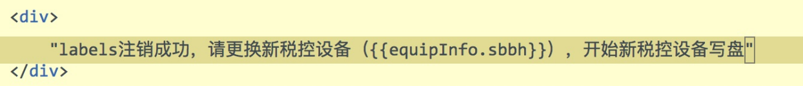
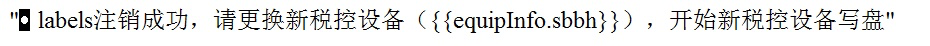
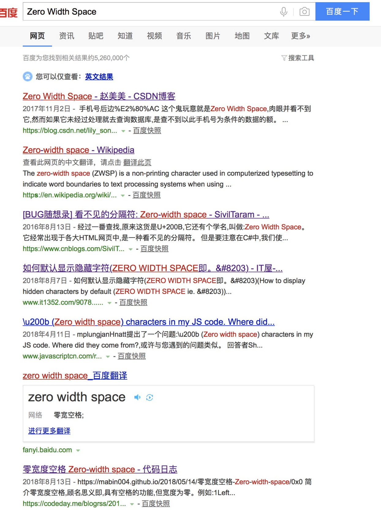

# 看不到但摸得到的捣蛋鬼---Zero Width Space

## 1.情况如何？
昨天，“某某某”的代码出现了一个bug。大概是这个情况：
有一个提示信息，需要展示，大概这样：



这行文字，在谷歌上一点问题都没有，但是在ie上出现了奇怪的框框。比如这样：



ie浏览器真的是代码检查器啊，稍微一个不注意，就搞事情～～～

## 2.so why？

经过我的多次实验、摆弄，发现一件事，我在双引号和label之间按下退格键、方向键，会发现，总是多出来一次操作，方向键、退格键总是需要多按一次，才可以删除前双引号。很奇怪很奇怪。
于是，我百度“听大悲咒时应该保持什么心情”、“天台上怎么样不会太冷”。。。
功夫不负有心人，我找到了这个关键词-----Zero Width Space。
百度了一下：



## 3.这是个什么东西呢？
```
Zero-width space的Unicode编码为U+FEFF，二进制编码为“\xE2\x80\x8E”,根据维基百科描述，其主要用于后台处理字符边界而又无需可见空格的情况。
```
简言之：具有空格的功能，但宽度为零。
为了搞清，我这个小东西的unicode的编码是什么，我在这个链接下

http://tool.chinaz.com/tools/unicode.aspx

把我的那个符号考进去，点击中文转unicode，然后就这样：


`备注：`这种符号可能有很多，大家可以在探索其他的相似符号.

## 4.代码搞一搞
我敲了一段代码：
```html
<input type="text" id="have10" />
<input type="text" id="have20" />
<script>
var uniCodeStr = "\u0008";
var str = eval("'"+uniCodeStr + "'")
var have10 = "10";
var have20 = "20";
for(var i = 0;i < 10 ; i++ ){
have10 += str;
}
for(var i = 0;i < 20 ; i++ ){
have20 += str;
}
document.getElementById('have10').value = have10;
document.getElementById('have20').value = have20;
</script>
```

ie上大概这样


谷歌上这样：


大家可以试一试，需要按10次退格键，才可以删到10的位置；需要按20次退格键，才可以删到20的位置。
是不是有一点恐怖？
看不到，但是又实实在在的存在。

## 5.危险
有这么几个场景，大家想象一下：
> 1.有人发了一个text文档，里面只有两个字母，但是接收时却卡死了电脑；
> 2.qq上陌生人发来了两个字，手机却重启了；
> 3.数据库查询的时候，字段、sql看起来都对，但是却查不出想要的结果；
> 4.url写的没问题，但是总是404～

## 6.解决
这个的话，百度搜索吧，方法也有很多，我就不赘述了

`备注：`转载请注明出处，


